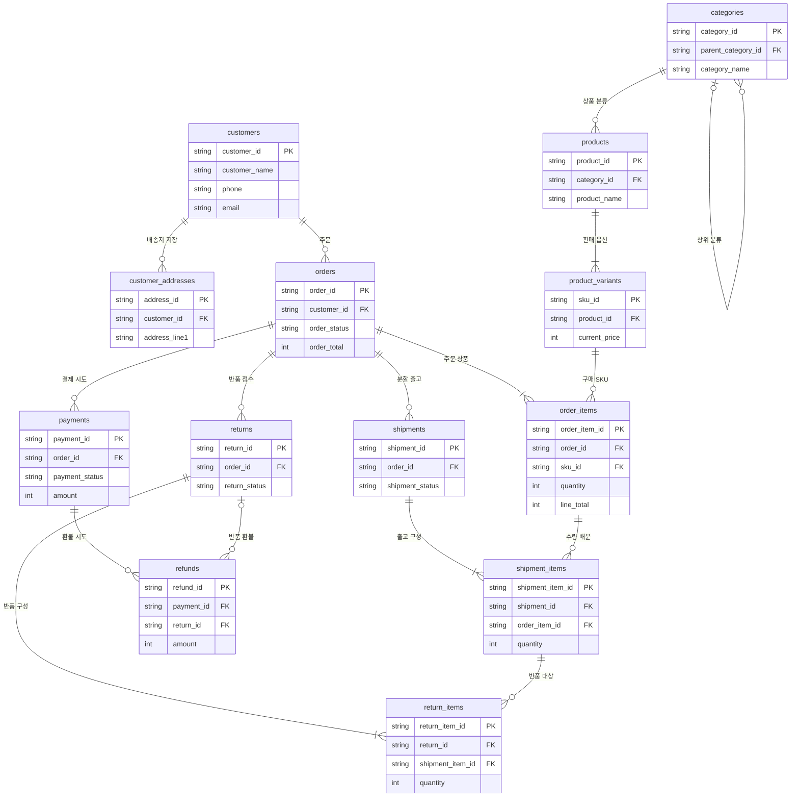

# 모아마켓 ERD

전체 필드와 타입은 [데이터 사전](data-dictionary.md), 관계 밖의 제약은 [업무 규칙](business-rules.md)을 따른다.

```mermaid
erDiagram
    direction TB
    customers ||--o{ customer_addresses : "배송지 저장"
    customers ||--o{ orders : "주문"
    categories o|--o{ categories : "상위 분류"
    categories ||--o{ products : "상품 분류"
    products ||--|{ product_variants : "판매 옵션"
    orders ||--|{ order_items : "주문 상품"
    product_variants ||--o{ order_items : "구매 SKU"
    orders ||--o{ payments : "결제 시도"
    orders ||--o{ shipments : "분할 출고"
    shipments ||--|{ shipment_items : "출고 구성"
    order_items ||--o{ shipment_items : "수량 배분"
    orders ||--o{ returns : "반품 접수"
    returns ||--|{ return_items : "반품 구성"
    shipment_items ||--o{ return_items : "반품 대상"
    payments ||--o{ refunds : "환불 시도"
    returns o|--o{ refunds : "반품 환불"

    customers {
        string customer_id PK
        string customer_name
        string phone
        string email
    }
    customer_addresses {
        string address_id PK
        string customer_id FK
        string address_line1
    }
    categories {
        string category_id PK
        string parent_category_id FK
        string category_name
    }
    products {
        string product_id PK
        string category_id FK
        string product_name
    }
    product_variants {
        string sku_id PK
        string product_id FK
        int current_price
    }
    orders {
        string order_id PK
        string customer_id FK
        string order_status
        int order_total
    }
    order_items {
        string order_item_id PK
        string order_id FK
        string sku_id FK
        int quantity
        int line_total
    }
    payments {
        string payment_id PK
        string order_id FK
        string payment_status
        int amount
    }
    shipments {
        string shipment_id PK
        string order_id FK
        string shipment_status
    }
    shipment_items {
        string shipment_item_id PK
        string shipment_id FK
        string order_item_id FK
        int quantity
    }
    returns {
        string return_id PK
        string order_id FK
        string return_status
    }
    return_items {
        string return_item_id PK
        string return_id FK
        string shipment_item_id FK
        int quantity
    }
    refunds {
        string refund_id PK
        string payment_id FK
        string return_id FK
        int amount
    }
```
